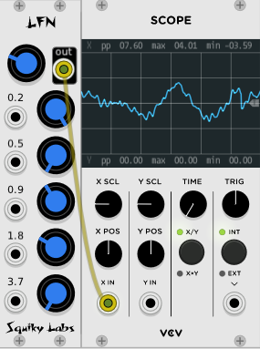
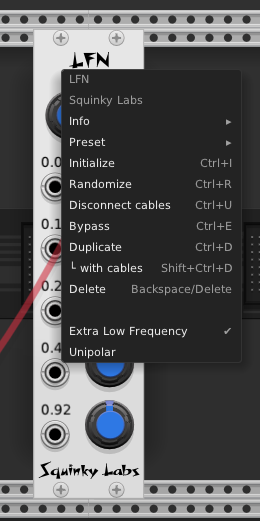

# LFN Low Frequency Noise Generator 

LFN stands for Low Frequency Noise. Technically it is a white noise generator run through a graphic equalizer at extremely low frequencies. People may find it easier to think of it as a random voltage source with unique control over the output.

The top knob, which is unlabeled, sets the "base frequency" of LFN.

The five other knobs, and the CV inputs beside them, control the gain of the graphic equalizers sections. Beside each EQ gain knob is a label indicating what frequency range that knob controls.

For example, it the base frequency is 1.0, the EQ sections will be at 1Hz, 2Hz, 4Hz, 8Hz, and 16Hz. If the base frequency is 0.2, The EQ sections will be at 0.2Hz, 0.4Hz, 0.8Hz, 1.6Hz, and 3.2Hz.

Normally the base frequency has a range of 0.1 Hz to 2.0 Hz. But there is an additional option in the context menu: Extra Low Frequency. When extra low frequency is enabled, the range is 0.01 Hz to 0.2 Hz.

We now also provide the option to select unipolar (0-10V) output instead of the standard -5 to 5V. Again this can be changed by going into the contect menu.

Just right click on LFN's panel to open the context menu. Here is an image:

Instead of thinking about frequencies like 1Hz, which are a little difficult to imagine, think of the knobs as mixing very slow random voltages with less slow ones. For example if LFN is driving a pitch quantizer into a VCO, turn all the knobs down to zero except the first, lowest, one. This will make a series of pitches slowly rising and falling. Then bring in a little of the faster channels. The pitch will still be slowly rising and falling, but will also quickly move up and down by smaller steps.

A good way to learn what makes LFN tick is to set it slow and watch it on the scope. At the same time run it straight into a VCO. Experiment with different mixes of the slow knobs and the fast ones.

As you would expect from Squinky Labs, the CPU usage of LFN is very low. In fact it is one of our leanest modules yet. So feel free to use as many instances as you like.
