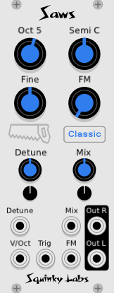

# Saws
Emulation of Roland Super-Saw, with stereo outputs and optional anti-aliasing. Now fully polyphonic.

Super-Saw can make huge sounds while using very little CPU.

## Description of Saws

Saws is an accurate emulation of the original Super-Saw found in Roland's JX-8000 synthesizer from 1996. We based our module on the research of Adam Szabo, who analyzed the original for his Bachelor's Thesis in 2010.

While there are several "super saws" for VCV, Saws is the closest to the original, as far as we know.

Saws contains seven sawtooth oscillators that all track the same control voltage. They may be de-tuned, and the mix can be controlled.

The original has an "interesting" approach to alias reduction. It makes no attempt to reduce the aliasing in the high frequencies, but it does have highpass filter tuned to the VCO frequency. This suppresses the really nasty alias tones that are below the fundamental. Combined with the detuned saws, the high frequency aliasing is said to add to the "airy" sound of the the Super-Saw.

The Super-Saw also assigned random phases to the saws each time a note is re-triggered, which prevents successive notes from all sounding the same. This feature, too, is available with Saws.

We have attempted to implement the Super-Saw as closely as possible, and have added no original features, other than an oversampling control which is normally off, and a stereo option.

## Stereo option

If both the left and right outputs are patched, Saws will generate stereo by panning the 7 sawtooth oscillators across the stereo field.

In classic mode, stereo operation takes almost no extra CPU. In the versions with less aliasing, stereo will take about twice as much CPU.

Make sure not to patch both outputs if you do not intend to use them. If you only listen to one side of stereo it won't sound as good as just using mono.

Stereo works with polyphony, too. In these patches both the left and right outputs are polyphonic.

## The controls

The pitch is controller by the signal patched into the **V/8 input**.

The **Octave** knob will transpose the VCO in even octaves. The setting is displayed above the knob.

The **Semi** knob will transpose the VCO in semitone intervals. It has a range of 11 semitones up or down. The semitone setting is displayed above the knob as note name, such as "G" or "C#".

The **fine** knob tunes the VCO by a semitone up or down.

The **FM** knob attenuates the pitch modulation signal patched into the **FM** input.

The **Detune** knob spreads out the pitch of the seven saws. The middle saw stays on pitch, but the other ones move away from it, both higher and lower, as the detune is increased.

There is a Detune CV that allows the de-tuning to be voltage controlled. As usual the is an attenuverter to scale the modulation.

The **Mix** knob controls the mixing of the de-tuned saws against the in-tune saw. Then the mix is all the way down, only the middle saw is heard. As with the Detune, the Mix may be voltage controller, and there is an attuenuverter.

Both the Mix and Detune controls were designed to respond just like the controls in the JP-8000.

**Hard Pan** is found in the context menu when you right-click on the Saws panel. In stereo mode, hard pan will put 6 of the VCOs exclusively in the left or right output. Hard pan has no effect when operating in mono.

The **Trigger** input is used implement the phase randomization on new notes that was mentioned above. Any time the Trigger input goes from low to high it will randomize the phase of all the saws. Ofter a gate from MIDI or a sequencer would be patched into the trigger input.

There is a button in the middle of the panel, which by default is labeled "Classic". This button controls the alias reduction. In the Classic setting we emulate the original - lots of high frequency aliasing and a high pass filter to remove the low frequency aliasing. In the "Clean 1" setting we remove the high-pass filters, and use 4X oversampling to reduce all the aliasing to low levels. "Clean 2" is similar, but increases the oversampling to 16X.

## Tips and tricks

Although it has seven independent sawtooth oscillators, Saws uses very little CPU, so if you want to use a lot of them, feel free.

For a "typical" super-saw patch, send the main control voltage to the V/8 input, and patch a gate or trigger into the Trigger input. Adjust the Detune and Mix to get as rich as sound as desired.

While the classic Super-Saw sound is very rich and animated, the aliasing can make it quite harsh, especially when played in the upper registers. Switching from "Classic" to "Clean 1" will dramatically change the sound in this case.

We don't expect many users will go for the "Clean 2" setting. It uses quite a bit more CPU than "Clean 1", and it is quite difficult to hear the difference.

To give a subtle sense of rhythmic pulsing, you may of course run a clock or LFO into the trigger input.

## A note about polyphony

The implementation of polyphony is fairly conventional. The number of channels coming into the V/8 input determines the number of "voices" that saws will generate. All of the other CV inputs may be fully polyphonic also. But if you patch a mono CV into any of the inputs of Saws then it will apply to all the voices in Saws.

## Additional information

Szabo's thesis, which we used to make Saws, has been moving around in the Internet, but last time we looked we found it [here](https://pdfs.semanticscholar.org/1852/250068e864215dd7f12755cf00636868a251.pdf)

The [WikiPedia article on the JP-8000](https://en.wikipedia.org/wiki/Roland_JP-8000) is informative.

There are many demo videos for the JP-8000 Super Saw, like [this one](https://www.youtube.com/watch?v=D0eTgyRkdDU)
